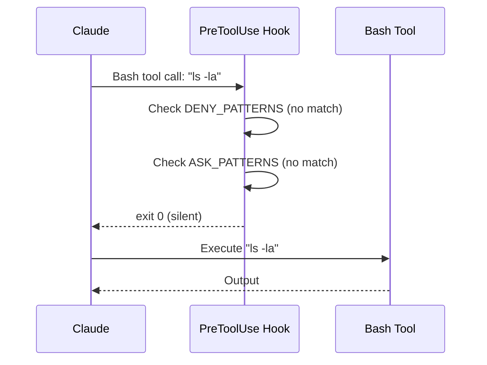
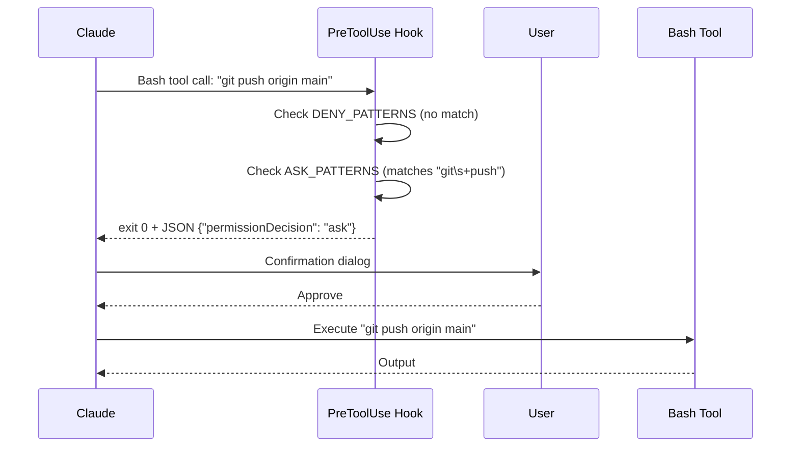
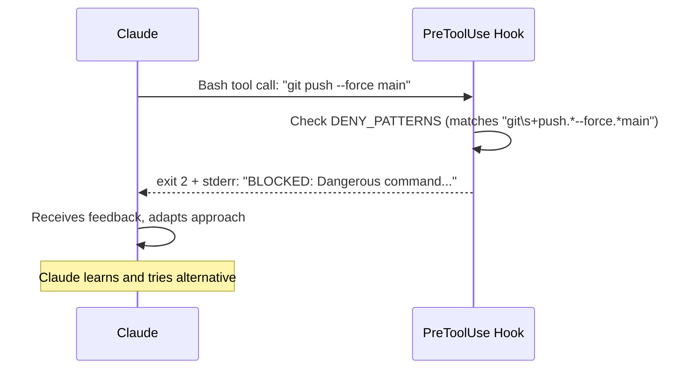
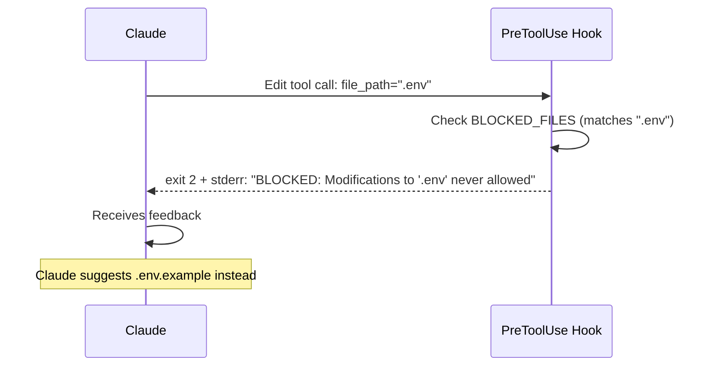

# Tech Design: Basic Protection

Navigation: [PRD](../../stories/1/prd.md)

## Overview

Claude Code users need protection from catastrophic commands even when running with `--dangerously-skip-permissions`. We implement PreToolUse hooks that intercept tool calls, pattern-match against dangerous operations, and either block (`exit 2`), require confirmation (`"ask"` decision), or allow execution.

## Architecture

```
┌─────────────────────────────────────────────────────────────────────┐
│                     Claude Code Tool Execution                       │
├─────────────────────────────────────────────────────────────────────┤
│  Tool Call (Bash/Edit/Write)                                        │
│       ↓                                                             │
│  PreToolUse Hook ──→ dangerous-command-guard.sh (for Bash)          │
│       │          └─→ protected-files-guard.py (for Edit/Write)      │
│       ↓                                                             │
│  Hook Decision:                                                     │
│    • exit 0 (no output) → Allow                                     │
│    • exit 0 + JSON {"permissionDecision": "ask"} → Confirm          │
│    • exit 2 + stderr message → Block + Feedback to Claude           │
│       ↓                                                             │
│  Deny Rules → Allow Rules → Ask Rules → Permission Mode → Execute   │
└─────────────────────────────────────────────────────────────────────┘
```

## Data Model

### HookInput (JSON via stdin)
```typescript
interface HookInput {
  tool_name: string;           // "Bash", "Edit", "Write", "MultiEdit"
  tool_input: BashInput | FileInput;
}

interface BashInput {
  command: string;             // The shell command to execute
}

interface FileInput {
  file_path?: string;          // Path for Edit/Write
  path?: string;               // Alternative path field
}
```

### HookOutput (JSON via stdout, exit 0)
```typescript
interface HookOutput {
  hookSpecificOutput: {
    hookEventName: "PreToolUse";
    permissionDecision: "allow" | "deny" | "ask";
    permissionDecisionReason: string;
  };
}
```

### Pattern Categories

#### DenyPatterns (Hard Block)
Commands that are NEVER allowed. Source: `docs/research/claude-safety-hooks-plugin.md:141-167`

| Category | Patterns | Rationale |
|----------|----------|-----------|
| Filesystem destruction | `rm -rf /`, `rm -rf *`, `rm -rf ~`, `> /dev/sd`, `mkfs`, `dd if=.*of=/dev/` | Irreversible data loss |
| Git disasters | `git reset --hard origin`, `git push --force main`, `git push -f master` | Destroys shared history |
| Database destruction | `DROP DATABASE`, `DROP SCHEMA.*CASCADE`, `TRUNCATE.*CASCADE` | Irreversible data loss |
| Docker nuclear | `docker system prune -a --volumes`, `docker volume prune -f` | Destroys all data volumes |
| Shell bypass (secrets) | `echo/cat/tee/sed/ed/cp/mv` targeting `.env`, `.pem`, `.key`, `id_rsa`, `secrets.yml`, `credentials.json`, `.git/config`, `.ssh/` | Bypass file protection via Bash |

#### AskPatterns (Require Confirmation)
Risky operations that need explicit approval. Source: `docs/research/claude-safety-hooks-plugin.md:172-224`

| Category | Patterns | Rationale |
|----------|----------|-----------|
| File deletion | `rm -rf`, `rm -r`, `rm .*\*` | Potential data loss |
| Git remote ops | `git push`, `git reset --hard`, `git clean -fd` | Affects remote/history |
| Package publish | `npm publish`, `yarn publish`, `cargo publish` | Public release |
| Docker data ops | `docker-compose down -v`, `docker volume rm`, `docker system prune` | Data volume risk |
| Database ops | `DROP TABLE`, `TRUNCATE`, `DELETE FROM` without WHERE | Data modification |
| Service control | `systemctl stop`, `kubectl delete` | Service disruption |
| Shell bypass (config) | `echo/cat/tee/sed` targeting `package-lock.json`, `Dockerfile`, `docker-compose.yml`, `.github/`, `Makefile`, `tsconfig.json`, `.claude/` | Bypass file protection via Bash |

#### BlockedFiles (Never Modify)
Files that are NEVER allowed to be modified. Source: `docs/research/claude-safety-hooks-plugin.md:283-297`

| Pattern | Rationale |
|---------|-----------|
| `.env`, `.env.local`, `.env.production` | Contains secrets |
| `.pem`, `.key`, `id_rsa`, `id_ed25519` | Private keys |
| `secrets.yml`, `credentials.json`, `service-account.json` | Credentials |
| `.git/config`, `.ssh/` | Git/SSH configuration |

#### ConfirmFiles (Require Confirmation)
Files that need explicit approval. Source: `docs/research/claude-safety-hooks-plugin.md:300-314`

| Pattern | Rationale |
|---------|-----------|
| `package-lock.json`, `yarn.lock`, `pnpm-lock.yaml` | Dependency locks |
| `Dockerfile`, `docker-compose.yml` | Container config |
| `.github/`, `.gitlab-ci.yml` | CI/CD config |
| `Makefile`, `tsconfig.json`, `pyproject.toml`, `Cargo.toml` | Build config |
| `.claude/` | Claude Code config |

## Interface

### dangerous-command-guard.sh

```bash
#!/usr/bin/env bash
# Input: JSON on stdin with tool_input.command
# Output:
#   - exit 0 (silent) → allow
#   - exit 0 + JSON → ask for confirmation
#   - exit 2 + stderr → block with feedback

main() → exit_code
  # Reads: stdin (JSON)
  # Writes: stdout (JSON for ask), stderr (message for block)
  # Returns: 0 (allow/ask) or 2 (block)
```

### protected-files-guard.py

```python
def main() -> NoReturn:
    """
    Input: JSON on stdin with tool_input.file_path or tool_input.path
    Output:
      - sys.exit(0) silent → allow
      - sys.exit(0) + JSON → ask for confirmation
      - sys.exit(2) + stderr → block with feedback
    """
```

## Algorithm

### dangerous-command-guard.sh

```
FUNCTION check_command(cmd: string) → (action, message)
  FOR pattern IN DENY_PATTERNS:
    IF cmd matches pattern (case-insensitive):
      RETURN (BLOCK, format_block_message(pattern, cmd))

  FOR pattern IN ASK_PATTERNS:
    IF cmd matches pattern (case-insensitive):
      RETURN (ASK, format_ask_json(pattern))

  RETURN (ALLOW, null)

MAIN:
  cmd = parse_stdin_json().tool_input.command
  action, message = check_command(cmd)

  SWITCH action:
    CASE BLOCK:
      write_stderr(message)
      exit(2)
    CASE ASK:
      write_stdout(message)
      exit(0)
    CASE ALLOW:
      exit(0)
```

### protected-files-guard.py

```
FUNCTION check_file(file_path: string) → (action, message)
  FOR pattern IN BLOCKED_FILES:
    IF pattern IN file_path:
      RETURN (BLOCK, format_block_message(pattern, file_path))

  FOR pattern IN CONFIRM_FILES:
    IF pattern IN file_path:
      RETURN (ASK, format_ask_json(pattern, file_path))

  RETURN (ALLOW, null)

MAIN:
  TRY:
    data = json.load(stdin)
    file_path = data.tool_input.file_path OR data.tool_input.path
    action, message = check_file(file_path)

    SWITCH action:
      CASE BLOCK:
        print(message, file=stderr)
        sys.exit(2)
      CASE ASK:
        print(json.dumps(message))
        sys.exit(0)
      CASE ALLOW:
        sys.exit(0)
  CATCH JSONDecodeError:
    print("Hook error: Invalid JSON input", file=stderr)
    sys.exit(1)
  CATCH Exception as e:
    print(f"Hook error: {e}", file=stderr)
    sys.exit(1)
```

## Sequence Diagrams

### Golden Path: Command Allowed



### Confirmation Path: Risky Command



### Block Path: Dangerous Command



### File Protection: Blocked File



## Error Handling

| Scenario | Exit Code | Behavior |
|----------|-----------|----------|
| Invalid JSON input | 1 | Non-blocking, logged in verbose mode |
| Pattern match exception | 1 | Non-blocking, execution continues |
| Missing command field | 0 | Allow (fail-open for malformed input) |
| Missing file_path field | 0 | Allow (fail-open for malformed input) |

### Design Decision: Fail-Open vs Fail-Closed

We choose **fail-open** for malformed input because:
1. Hook errors shouldn't block legitimate work
2. The underlying permission system still applies
3. Users can debug via verbose mode

However, pattern matching is **fail-closed**: if a pattern matches, we always block/ask.

## File Structure

```
.claude/
├── hooks/
│   ├── dangerous-command-guard.sh    # Task 1.1
│   └── protected-files-guard.py      # Task 1.2
├── plugins/
│   └── safety-guard/
│       └── manifest.json             # Task 1.3
└── settings.json                     # Task 1.4 (hook registration)
```

## Testing Strategy

### Manual Testing

1. **Blocked commands**: Run `rm -rf /tmp/test` and verify block message
2. **Ask commands**: Run `git push` and verify confirmation dialog appears
3. **Blocked files**: Try editing `.env` and verify block
4. **Allowed operations**: Run `ls` and verify no interference

### Test Cases

| Test | Input | Expected |
|------|-------|----------|
| Block rm -rf / | `{"tool_input":{"command":"rm -rf /"}}` | exit 2, stderr contains "BLOCKED" |
| Block force push | `{"tool_input":{"command":"git push --force main"}}` | exit 2 |
| Ask git push | `{"tool_input":{"command":"git push"}}` | exit 0, JSON with "ask" |
| Allow ls | `{"tool_input":{"command":"ls -la"}}` | exit 0, no output |
| Block .env | `{"tool_input":{"file_path":".env"}}` | exit 2 |
| Ask Dockerfile | `{"tool_input":{"file_path":"Dockerfile"}}` | exit 0, JSON with "ask" |
| Allow src/main.ts | `{"tool_input":{"file_path":"src/main.ts"}}` | exit 0, no output |

## Tasks

| Task | File | Description |
|------|------|-------------|
| 1.1 | [dangerous-command-guard.sh](./tasks/1.1-dangerous-command-guard.md) | Bash hook for command filtering |
| 1.2 | [protected-files-guard.py](./tasks/1.2-protected-files-guard.md) | Python hook for file protection |
| 1.3 | [manifest.json](./tasks/1.3-manifest.md) | Plugin manifest |
| 1.4 | [settings.json](./tasks/1.4-settings.md) | Hook registration in project settings |
